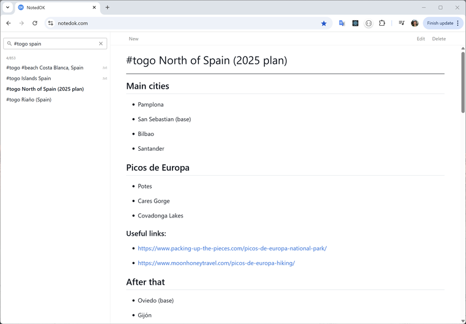
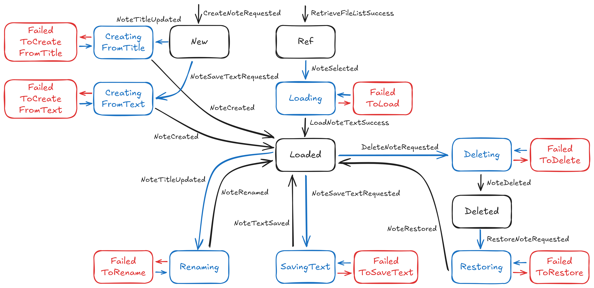

# NotedOK

NotedOK web app (https://notedok.com/) is a personal markdown-based note making tool. Every note is stored internally as a markdown file in S3.



### Note on project architecture

_This is a port of a project I started back in 2013, so you can still find some code that is pretty old and just moved as is. The part related to UI rendering, logic and event handling is completely reworked to align with my own proposed experimental [guidelines](https://github.com/artemkv/frontend_guidelines)._

## Note state transition diagram



### Most important project files

- `src\model.ts` contains the boxes, i.e. types for each of the note states. _All the types are treated as immutable_
- `src\noteLifecycle.ts` contains the arrows, i.e. all the valid state transitions. _All the functions here are pure_
- `src\events.ts` contains the full list of events that are generated by components/commands. _All the types are treated as immutable_
- `src\commands.ts` contains all the commands that can be issued. _All the types are treated as immutable_
- `src\reducer.ts` handles all the events by delegating actual execution to `src\business.ts`. _All the functions here are pure_
- `src\business.ts` is the one fully covered by unit-tests (`src\business.tests.ts`). All the interesting things are happening there
- Side effects (such as generating random unique note titles) are only allowed in commands (meaning: actual implementations of commands, for example, `src\commands\storage.ts`)
- All the components are aimed to be pure (as much as possible) and, by default, don't manage their own state
- The app state is managed using custom-made `src\hooks\useReducer.ts` hook. The reason to use custom hook is that I like the Elm model where reducer spits out new state and command, and the existing `useReducer` only returns the new state. I don't like thunks and stuff like that
- The app state lives in `src\AppStatefulContainer.tsx`, the uppermost component

## Running the app

Development

```
npm run dev
```

Prod build:

```
npm run build
```

# TODO: (this comes from Vite template) Expanding the ESLint configuration

If you are developing a production application, we recommend updating the configuration to enable type-aware lint rules:

```js
export default tseslint.config({
  extends: [
    // Remove ...tseslint.configs.recommended and replace with this
    ...tseslint.configs.recommendedTypeChecked,
    // Alternatively, use this for stricter rules
    ...tseslint.configs.strictTypeChecked,
    // Optionally, add this for stylistic rules
    ...tseslint.configs.stylisticTypeChecked,
  ],
  languageOptions: {
    // other options...
    parserOptions: {
      project: ["./tsconfig.node.json", "./tsconfig.app.json"],
      tsconfigRootDir: import.meta.dirname,
    },
  },
});
```

You can also install [eslint-plugin-react-x](https://github.com/Rel1cx/eslint-react/tree/main/packages/plugins/eslint-plugin-react-x) and [eslint-plugin-react-dom](https://github.com/Rel1cx/eslint-react/tree/main/packages/plugins/eslint-plugin-react-dom) for React-specific lint rules:

```js
// eslint.config.js
import reactX from "eslint-plugin-react-x";
import reactDom from "eslint-plugin-react-dom";

export default tseslint.config({
  plugins: {
    // Add the react-x and react-dom plugins
    "react-x": reactX,
    "react-dom": reactDom,
  },
  rules: {
    // other rules...
    // Enable its recommended typescript rules
    ...reactX.configs["recommended-typescript"].rules,
    ...reactDom.configs.recommended.rules,
  },
});
```
